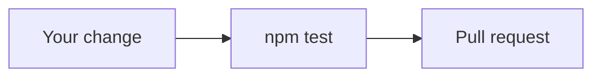

# Contributing

Checkpoint reads the git diff and follows `checkpoint.policy.json`. Exit 0 allows. Exit 2 blocks. A sentence in the agent's plan cannot clear a block.



## Set up

```bash
git clone https://github.com/Dipen-t/checkpoint.git
cd checkpoint
npm install
npm test
npm run typecheck
```

Try a command:

```bash
npm run dev -- adopt local
npm run dev -- check
```

## Where to edit

| Path | Edit this when |
| --- | --- |
| `src/policy/` | You change what the policy file means |
| `src/commands/check.ts` | You change allow and block |
| `src/ledger/` | You change the signed record |
| `examples/` | You add a policy people can copy |
| `tests/` | You lock the behavior |

## Add a rule

Copy the object in [examples/your-rule.json](examples/your-rule.json).

- `denyPaths` — where the line is forbidden
- `allowPaths` — where that same line is fine
- `denyLine` — text on a new line

Add a test that runs `evaluatePolicy` and expects your rule id. Build a fake token in the test. Do not paste a real one.

## Open a pull request

1. `npm test` passes.
2. `npm run typecheck` passes.
3. The new behavior has a test.
4. A new command is in the README.

Say what failed before, and what the diff shows now.
