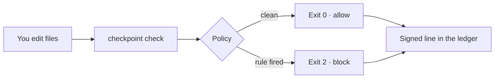
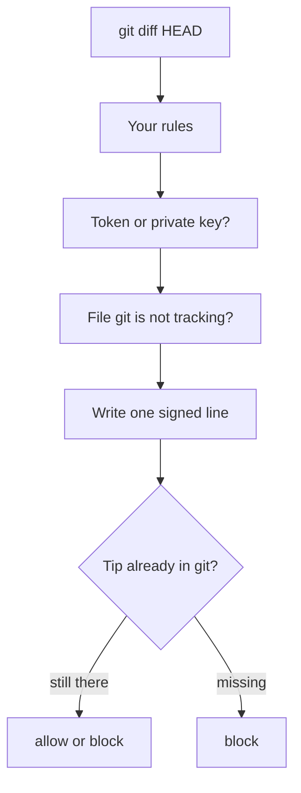

# Checkpoint

A gate for any git repository. You save a policy file. Checkpoint reads the code change and blocks it when that file says so. The agent's sentence cannot clear a block.



## Start

```bash
npx checkpoint adopt local
npx checkpoint check
```

`local` fits one person. A normal edit passes. A token in the new lines does not. The token is not saved.

## Pick a setup

| | Who | Command | What you get |
| --- | --- | --- | --- |
| 🧑 | One person | `npx checkpoint adopt local` | A signed record on your laptop |
| 👥 | A team | `npx checkpoint adopt team` | The same check, plus a CI job and a second reviewer |
| 🏠 | House servers | `npx checkpoint adopt house` | The team setup, plus Prisma stays in Services, Utils, or Database |

No name? A repo with `Services` and `Controllers` next to each other gets `house`. Every other repo gets `team`.

`adopt` will not replace a policy file that is already there.

### One person

```bash
npx checkpoint adopt local
npx checkpoint check
```

Copy [examples/student.json](examples/student.json) if you want to start from a file.

### A team

```bash
npx checkpoint adopt team
```

1. Put a real email in `reviewers` inside `checkpoint.policy.json`.
2. Commit `.github/workflows/checkpoint.yml` or `.gitlab-ci.checkpoint.yml`.
3. On GitHub or GitLab, require the check named `checkpoint` before merge.

[examples/team.json](examples/team.json) has a placeholder email. Deleting that workflow file is a block.

### House servers

Prisma is created in `server/src/Database` and called from Services and Utils. Controllers, routes, the client, and the website do not get new Prisma calls. Login stays `POST /api/auth/login`.

```bash
npx checkpoint adopt house
```

## Your own rule

Add one object to `imports`. Change the words to match your app.

```json
{
  "id": "views-do-not-query",
  "severity": "error",
  "denyPaths": ["**/views/**", "**/templates/**"],
  "allowPaths": [],
  "denyLine": ["eval(", "mysqli_query"],
  "message": "Views render. Queries stay in the service."
}
```

[examples/your-rule.json](examples/your-rule.json) is a full file you can copy. `error` blocks. `warn` prints and still exits 0. An exception needs a rule id, a path, a reason, and an `expires` date. A past date does not clear the block.

## The policy file

| Field | Plain meaning |
| --- | --- |
| `witness` | `local` = laptop only. `ci` = the GitHub or GitLab job must be in git. |
| `requireReviewer` | `true` = someone other than the author must be named. |
| `reviewers` | Those people's emails. |
| `imports` | Your path and line rules. |
| `approvalRequired` | Files that need a person. The policy and CI files are already listed. |
| `exceptions` | A temporary pass. It dies on the `expires` date. |

## What the check does



| You see | Meaning |
| --- | --- |
| Exit 0 | The diff passed this policy. |
| Exit 2 | Stop. Cursor and Claude Code already treat 2 as deny. |
| `local` | The laptop passed. The merge still needs the CI job when `witness` is `ci`. |
| `npx checkpoint ledger` | `intact` means the lines still match. `broken at N` means line N was edited. |

Each line stores hashes of the policy, the diff, and the public key. It does not store the file contents or the token. The private key stays outside the repo. A later signature can add a line. It cannot drop a hash that git already committed. A copied private key can still add a line. A force-push removes the old tip on the remote.

## Login

`npx checkpoint login` keeps `POST /api/auth/login` and writes each try to `server/.checkpoint/auth/ledger.jsonl`. It saves the time, the outcome, and the reason. It does not save the password.

## Commands

```text
checkpoint adopt [path] [local|team|house]
checkpoint check [path]
checkpoint ledger
checkpoint login [path]
checkpoint doctor
```

`doctor` checks that the project layout is readable and, when a ledger exists, that its chain is intact.

Other commands (`init`, `status`, `verify`, `decisions`, `explain`, `inspect`) belong to the older plan check. They do not override `checkpoint check`.

## Contributing

[CONTRIBUTING.md](CONTRIBUTING.md) is the short path: clone, `npm test`, `npm run typecheck`, open a pull request. Put a new rule in `examples/` and in a test. Do not put a real secret in either.

## Scope

This is a local gate you commit. It does not replace your git host. There is no hosted model in the default setup. If a model check cannot run, a serious result stays blocked.

## License

MIT
